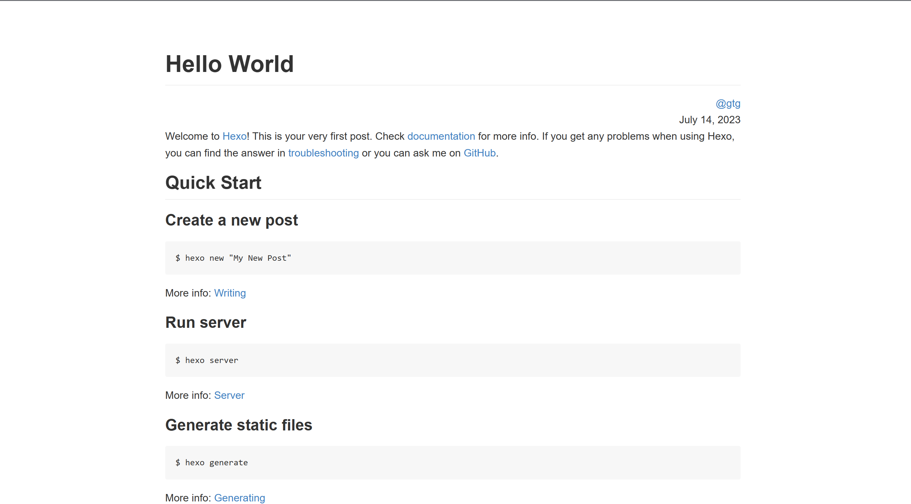

# Hexo Theme Paperblank

## description

Minimal, extremely simple, paper-liked theme. All top bars and sidebars do not exist by default.

## Overview



## Inspiration & use for reference

[hexo-theme-paperwhite](https://github.com/aeilot/hexo-theme-paperwhite)

## Configuration
Here’s the default `_config.yml`. The relevant description has been placed in the comments.
```yml
# things you want to let guest know
descriptions: "The darkest hour is just before the dawn."


# add menu items if you want
# make sure you have generated the pages before
menu:


# recommended configuration of hightlight
highlight:
  enable: true
  line_number: false
  auto_detect: false
  tab_replace: ''
  wrap: false
  hljs: true
prismjs:
  enable: false
  preprocess: true
  line_number: true
  tab_replace: ''
```

